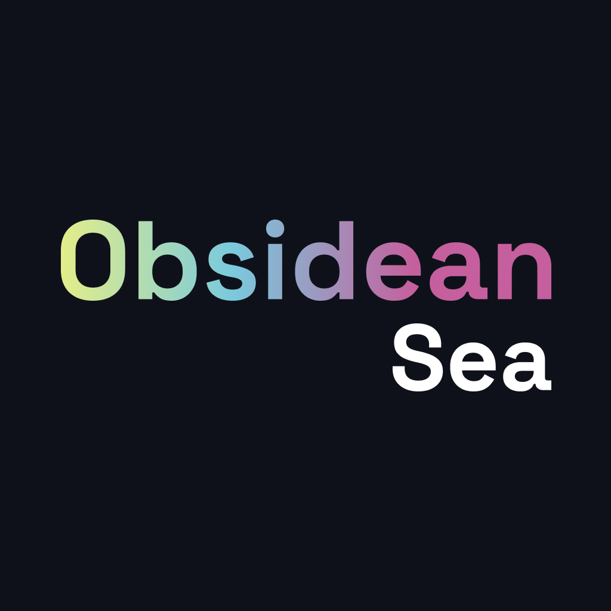
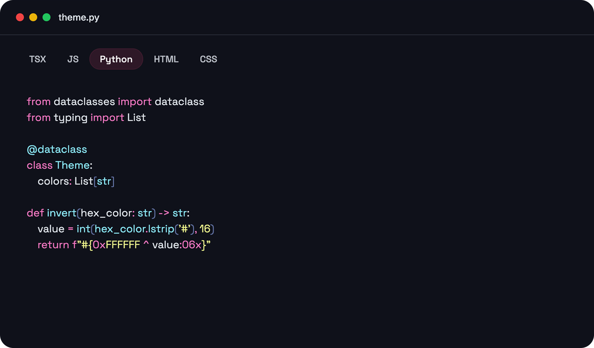
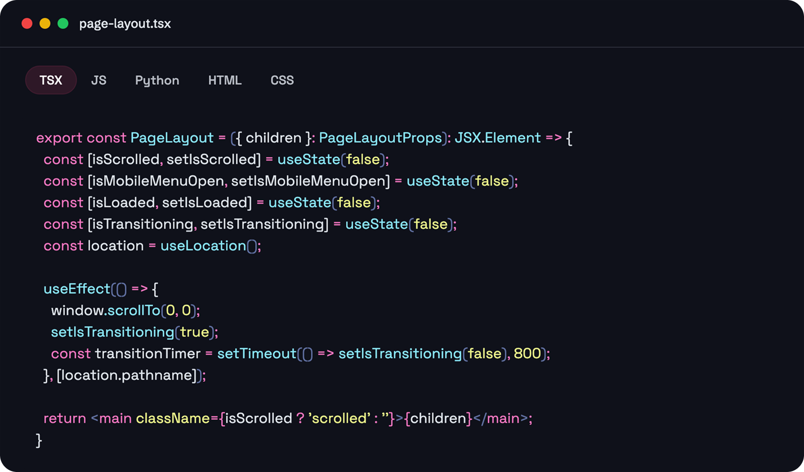

# Obsidian Sea VS Code Theme

A beautiful dark theme for Visual Studio Code generated by Codedye, inspired by the deep, mysterious colors of the ocean.

## Description

Obsidian Sea is a carefully crafted dark theme that provides excellent readability and a soothing coding experience. The theme features a rich palette of oceanic colors that reduce eye strain during long coding sessions.

## Installation

### From VS Code Marketplace

1. Open Visual Studio Code
2. Go to Extensions (Ctrl+Shift+X / Cmd+Shift+X)
3. Search for "Obsidian Sea"
4. Click Install
5. Go to File > Preferences > Color Theme and select "Obsidian Sea"

### Manual Installation

1. Download the latest `.vsix` file from the [releases page](https://github.com/eight84/obsidian-sea-vscode-theme/releases)
2. Open VS Code
3. Run `Extensions: Install from VSIX...` command
4. Select the downloaded `.vsix` file
5. Activate the theme from File > Preferences > Color Theme

## Screenshots

### Python Code

### TypeScript/TSX Code

## Features

- 🌊 **Ocean-inspired color palette** - Deep, calming colors that reduce eye strain
- 🔍 **Excellent readability** - Carefully chosen contrast ratios for optimal code visibility
- 🎨 **Syntax highlighting** - Thoughtfully designed colors for different code elements
- 🌙 **Dark theme** - Perfect for low-light coding sessions
- ⚡ **Optimized for modern languages** - Great support for JavaScript, TypeScript, Python, and more

## Supported Languages

This theme provides excellent syntax highlighting for:

- JavaScript/TypeScript
- Python
- HTML/CSS
- JSON
- Markdown
- And many more!

## Version History

- **1.3.0** - Latest version with improved syntax highlighting and new assets
- **1.2.0** - Enhanced color scheme and bug fixes
- **1.0.0** - Initial release

## Contributing

Found a bug or have a suggestion? Feel free to open an issue or submit a pull request on [GitHub](https://github.com/eight84/obsidian-sea-vscode-theme).

## License

This project is licensed under the MIT License - see the [LICENSE](LICENSE) file for details.

## Credits

Theme generated by [Codedye](https://codedye.com) and customized by eight84.

---

**Enjoy coding with Obsidian Sea! 🌊**
